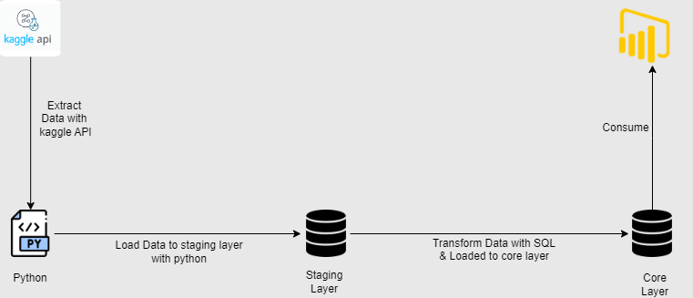

# Startup Success and Failure Analysis

## Overview
This project explores the factors influencing the success and failure of startups by analyzing relevant datasets. The analysis is performed using SQL Server, following the ELT (Extract, Load, Transform) approach. The data was sourced from Kaggle and loaded into SQL Server for detailed analysis.

##Architecture Diagram

  

## Project Structure
The project is organized into various stages, each documented with corresponding SQL queries and their outputs:

- **Extraction**: Data was extracted from Kaggle using the Kaggle API and loaded into SQL Server using Python scripts.
  
- **Loading**: The extracted data was imported into SQL Server using SQL Server Management Studio (SSMS) 20.

- **Transformation**: SQL queries were written to clean, process, and analyze the data. These queries, along with their outputs, are documented in the `Transform.md` file for easy reference.

## Data Details
The dataset contains various fields relevant to startup analysis, such as funding rounds, currency identifiers, and more. Special care was taken to handle duplicate entries, ensuring that each startup is unique within the dataset.

### Handling Zero Values
The dataset includes many zero values in the `funding_per_round` column. Specific SQL queries were written to handle and analyze these values effectively.

## Folder Structure

- **img/**: Contains all images used in the documentation and the dashboard.
  
- **Transform.md**: Contains the SQL transformation queries and their outputs.
  
- **startup.ipynb**: Jupyter notebook Contains the python script for Extraction and loading data.

## Tools and Technologies

- **SQL Server Management Studio (SSMS) 20**: Used for database management and executing SQL queries.
  
- **Python**: Utilized for data extraction and loading into SQL Server.
  
- **GitHub**: Version control and project documentation.
  
- **VS Code**: Primary development environment where the Markdown file was authored.

## How to Use
To explore this project:
1. Clone the repository to your local machine.
2. Follow the startup.ipynb file to fecth and run script.
3. If a table already exists in your database, use the **append** operation to add data. If the table does not exist, use the **replace** operation to create it and insert the data.
4. Follow the SQL queries in the `Transform.md` file to understand the data transformation process.

## Conclusion
This project provides a comprehensive analysis of startup success and failure factors using SQL Server. The combination of detailed SQL transformations and an interactive dashboard offers valuable insights into the data.
