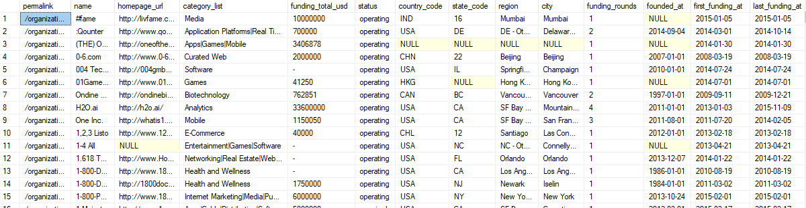
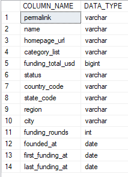

## STEP-3: TRANSFORM

We have uploaded data to sql server and will transform data there.

> 1.  **Is data loaded or not**
``` SQL
    Select * from startup_stage;
```

&nbsp;&nbsp;&nbsp;&nbsp;&nbsp;output

&nbsp;&nbsp;&nbsp;&nbsp;&nbsp;


> 2.  **Check for Table Schema**
``` SQL
    SELECT COLUMN_NAME, DATA_TYPE
    FROM INFORMATION_SCHEMA.COLUMNS
    WHERE TABLE_NAME = 'startup_stage';
```

&nbsp;&nbsp;&nbsp;&nbsp;&nbsp;output

&nbsp;&nbsp;&nbsp;&nbsp;&nbsp;


> 3. **Check for Duplicates**
``` SQL
    select name, count(*) as dulpicate
    from startup_stage
    group by name
    having count(*) >1;
```

&nbsp;&nbsp;&nbsp;&nbsp;&nbsp;output

&nbsp;&nbsp;&nbsp;&nbsp;&nbsp;


> 4. **Remove Duplicates**
``` SQL
    WITH CTE AS (
        SELECT *,
            ROW_NUMBER() OVER (PARTITION BY name ORDER BY CASE WHEN name IS NULL THEN 1 ELSE 0 END) AS row_num
        FROM startup_stage
    )
    -- Delete rows where row number is greater than 1, i.e., duplicates with empty data
    DELETE FROM CTE
    WHERE row_num > 1;
```

&nbsp;&nbsp;&nbsp;&nbsp;&nbsp;output

&nbsp;&nbsp;&nbsp;&nbsp;&nbsp;


> 5. **Count unique Startups**
```SQL
    SELECT COUNT(DISTINCT name) AS unique_count
    FROM startup_stage;
```

&nbsp;&nbsp;&nbsp;&nbsp;&nbsp;output

&nbsp;&nbsp;&nbsp;&nbsp;&nbsp;


> 6. **Basic Statistics**
```SQL
    SELECT 
        SUM(funding_total_usd) AS total_funding,
        AVG(funding_total_usd) AS average_funding,
        MIN(funding_total_usd) AS min_funding,
        MAX(funding_total_usd) AS max_funding
    FROM startup_stage;
```

&nbsp;&nbsp;&nbsp;&nbsp;&nbsp;output

&nbsp;&nbsp;&nbsp;&nbsp;&nbsp;


> 7. **Top 10 Average Funding Amounts Across Startups**
``` SQL
    SELECT TOP 10
        name,
        AVG(funding_total_usd) AS avg_funding_amount
    FROM startup_stage
    GROUP BY name
    order by avg_funding_amount desc;
```

&nbsp;&nbsp;&nbsp;&nbsp;&nbsp;output

&nbsp;&nbsp;&nbsp;&nbsp;&nbsp;


> 8. **Distribution of funding amounts by range**
```SQL
    SELECT 
        CASE 
            WHEN funding_total_usd < 1000000 THEN 'Under 1M'
            WHEN funding_total_usd BETWEEN 1000000 AND 5000000 THEN '1M to 5M'
            WHEN funding_total_usd BETWEEN 5000000 AND 10000000 THEN '5M to 10M'
            ELSE 'Over 10M'
        END AS funding_range,
        COUNT(*) AS count_startups
    FROM startup_stage
    GROUP BY 
        CASE 
            WHEN funding_total_usd < 1000000 THEN 'Under 1M'
            WHEN funding_total_usd BETWEEN 1000000 AND 5000000 THEN '1M to 5M'
            WHEN funding_total_usd BETWEEN 5000000 AND 10000000 THEN '5M to 10M'
            ELSE 'Over 10M'
        END;
```

&nbsp;&nbsp;&nbsp;&nbsp;&nbsp;output

&nbsp;&nbsp;&nbsp;&nbsp;&nbsp;


> 9. **Count of startups by category**
```SQL
    SELECT Top 10
    category_list, COUNT(*) AS count_startups 
    FROM startup_stage
    GROUP BY category_list
    ORDER BY count_startups DESC;
```

&nbsp;&nbsp;&nbsp;&nbsp;&nbsp;output

&nbsp;&nbsp;&nbsp;&nbsp;&nbsp;


#### Feature Engineering

> 1. **Funding amount per Round**
```SQL
    SELECT TOP 10
        name,
        funding_total_usd / funding_rounds AS funding_per_round
    FROM startup_stage;
```

&nbsp;&nbsp;&nbsp;&nbsp;&nbsp;output

&nbsp;&nbsp;&nbsp;&nbsp;&nbsp;


> 2.  **Time between funding rounds**
```SQL
    SELECT TOP 10
        name,
        DATEDIFF(day, first_funding_at, last_funding_at) / (funding_rounds - 1) AS avg_days_between_rounds
    FROM startup_stage
    WHERE funding_rounds > 1;
```

&nbsp;&nbsp;&nbsp;&nbsp;&nbsp;output

&nbsp;&nbsp;&nbsp;&nbsp;&nbsp;


> 3. **Count of startups by status for each country**
```SQL
    SELECT Top 10
        country_code,
        status,
        COUNT(*) AS count_startups
    FROM startup_stage
    GROUP BY country_code, status
    ORDER BY country_code, status;
```

&nbsp;&nbsp;&nbsp;&nbsp;&nbsp;output

&nbsp;&nbsp;&nbsp;&nbsp;&nbsp;


> 4. **Select specific country and count startups by status**
```SQL
    SELECT 
        country_code,
        status,
        COUNT(*) AS count_startups
    FROM startup_stage
    WHERE country_code IN ('PAK', 'IND', 'USA')
    GROUP BY country_code, status
    ORDER BY country_code, status;
```

&nbsp;&nbsp;&nbsp;&nbsp;&nbsp;output

&nbsp;&nbsp;&nbsp;&nbsp;&nbsp;


> 5.  **Calculate success to failure rate  for given countries**
```SQL
WITH status_counts AS (
    SELECT 
        country_code,
        status,
        COUNT(*) AS count_startups
    FROM startup_stage
    WHERE country_code IN ('PAK', 'IND', 'USA')
    GROUP BY country_code, status
),
success_failure_counts AS (
    SELECT
        country_code,
        SUM(CASE WHEN status IN ('operating', 'ipo') THEN count_startups ELSE 0 END) AS success_count,
        SUM(CASE WHEN status IN ('closed', 'acquired') THEN count_startups ELSE 0 END) AS failure_count
    FROM status_counts
    GROUP BY country_code
)
SELECT
    country_code,
    success_count,
    failure_count,
    CASE 
        WHEN failure_count > 0 THEN ROUND(success_count * 1.0 / failure_count, 2)
        ELSE NULL
    END AS success_to_failure_rate
FROM success_failure_counts
ORDER BY country_code;
```

&nbsp;&nbsp;&nbsp;&nbsp;&nbsp;output

&nbsp;&nbsp;&nbsp;&nbsp;&nbsp;
